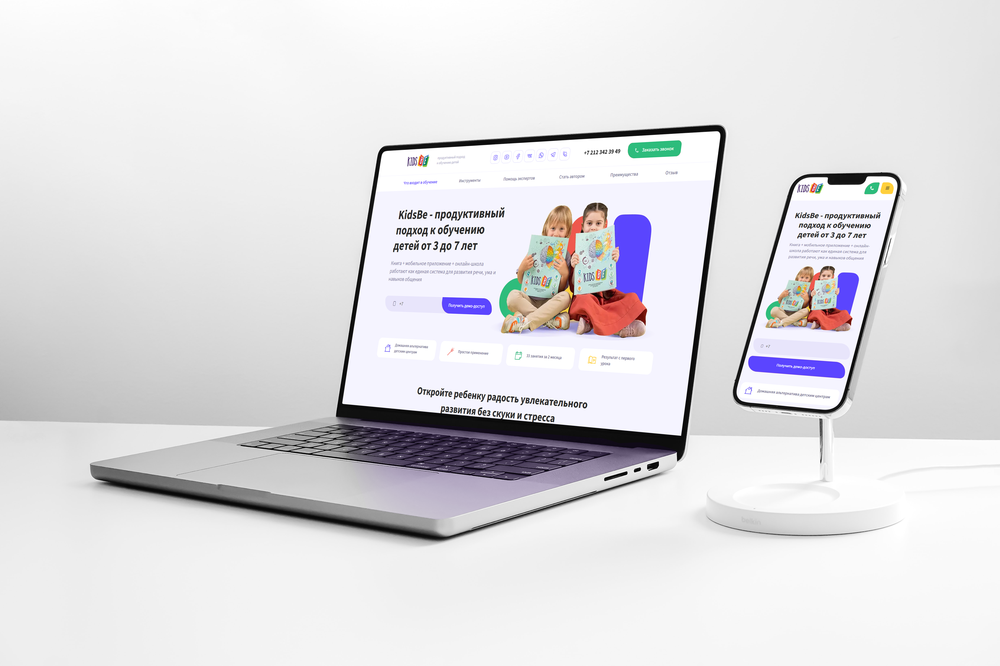

# KidsBe Landing Page

> 🌟 Адаптивная HTML/CSS/JS вёрстка лендинга образовательной программы для детей

🧒 **KidsBe** — это интерактивный лендинг, созданный в чистом HTML, CSS и JavaScript, с адаптивной версткой под любые устройства. Он демонстрирует продуктивный подход к обучению детей от 3 до 7 лет и содержит удобное меню, мультимедийный контент и красивые визуальные блоки для пользователей.

---

## 🔗 Ссылки

📌 **Live preview:**  
👉 https://wlad96.github.io/kidsbe-landing/

🎨 **Figma дизайн:**  
👉 https://www.figma.com/proto/9ncc7YeP83a2r8MxO7e5oE/%D1%88%D0%BA%D0%BE%D0%BB%D0%B0-%D0%B4%D0%BB%D1%8F-%D0%B4%D0%B5%D1%82%D0%B5%D0%B9--1-?node-id=0-3&p=f&t=Eq0rajRbbSlosRYf-1&scaling=min-zoom&content-scaling=fixed&page-id=0%3A1

📦 **GitHub репозиторий:**  
👉 https://github.com/wlad96/kidsbe-landing

---

## 🖼 Preview

---

## 🛠 Используемые технологии

- **HTML5** — семантическая разметка
- **CSS3** — адаптивная вёрстка, Flexbox, media queries
- **JavaScript (Vanilla JS)** — интерактив и логика
- **Responsive Design** — поддержка мобильных устройств
- **GitHub Pages** — деплой и live preview

---

## ✨ Особенности проекта

- Адаптивное мобильное меню
- Корректная работа в iOS Safari
- Использование relative-path (подходит для GitHub Pages)
- Чистая и читаемая структура проекта

---

## 🚀 Локальный запуск

1. Клонировать репозиторий:
   git clone https://github.com/wlad96/kidsbe-landing.git
2. Открыть index.html в браузере

---

## 💼 Назначение проекта

Проект выполнен в учебных и портфолио целях и демонстрирует навыки современной адаптивной вёрстки без фреймворков.

